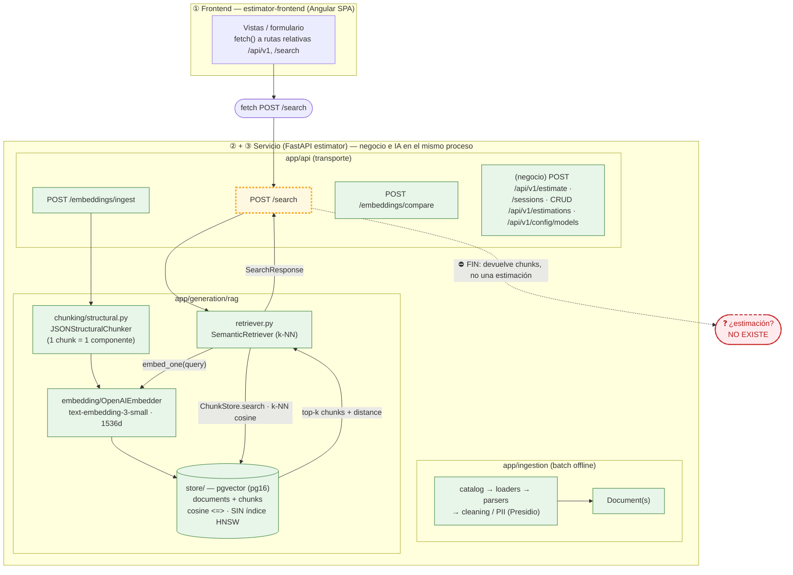
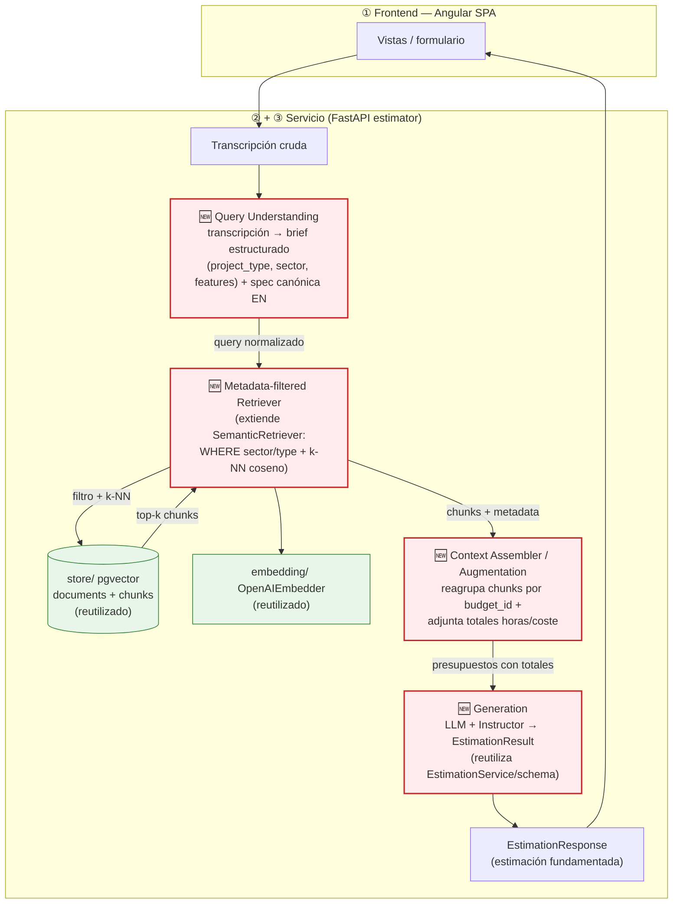

# Diagnóstico arquitectónico — Sesión 09 (pre-work)

Estado del servicio IA `estimator` al cierre de Sesión 08, comportamiento observado al pasarle una
transcripción cruda, fallos concretos y propuesta de evolución hasta cerrar el bucle
transcripción → estimación.

> **Cómo está escrito este documento.** Las observaciones van en español; los comandos, payloads y
> nombres de campo van en inglés. El trace de la sección 2 **se ejecutó el 2026-06-18** contra la pila
> local (Postgres+Redis en Docker, API en host con `uv`); los valores (distancias, normas, IDs) son
> **reales** y reproducibles con los comandos incluidos.

> **Nota de fidelidad.** El enunciado describe el servicio IA con nombres genéricos (`ingest/`,
> `embedding_pipeline/`, `storage/`). Este repo los implementa con otra forma; el documento describe la
> arquitectura **real** del repo: servicio IA en FastAPI con `app/ingestion/` (pipeline batch offline) y
> `app/generation/rag/` (`chunking/structural.py`, `embedding/`, `store/`, `retriever.py`,
> `ingest_service.py`), endpoints `POST /embeddings/ingest`, `POST /search` y `POST /embeddings/compare`.
> El frontend es una **SPA Angular** (`estimator-frontend/`) que llama al servicio por rutas relativas
> (no hay un backend de negocio Rails intermedio: el propio FastAPI expone también los endpoints de
> negocio). La persistencia es **un único** Postgres `pgvector/pgvector:pg16` (driver `psycopg` v3), no
> dos instancias. El corpus son **15 presupuestos / 60 componentes** repartidos en 4 sectores
> (e-commerce, fintech, healthcare, industrial).

---

## 1. Diagrama de la arquitectura actual (cierre S08)

Tres capas. El servicio de negocio y el servicio IA conviven en el mismo FastAPI. El **borde amarillo**
marca dónde acaba lo implementado hoy: el flujo muere en *"lista de chunks + distancias"*. **No existe
ninguna flecha que vaya desde una transcripción hasta una estimación.**



**Lectura del diagrama.** Lo implementado (verde) cubre dos caminos: (a) **ingesta** —
`/embeddings/ingest` valida el presupuesto contra el schema `Budget`, lo trocea en chunks por
componente (`JSONStructuralChunker`: *un componente = un chunk*), los embebe con
`text-embedding-3-small` (1536 dims) y los persiste en pgvector (`documents` + `chunks`); (b)
**búsqueda** — `/search` recibe `{query, k}`, re-embebe el texto de consulta con el mismo modelo y pide
a `ChunkStore.search` los *k* chunks más cercanos por distancia coseno (`<=>`). El borde amarillo
(`/search`) es el último eslabón vivo: **su salida es una lista de `SearchHit` (chunk + distancia), no
una estimación**. La caja roja (transcripción → estimación) no existe en ninguna forma. El propio
docstring del retriever lo confirma: *"No vector index and no metadata filtering yet — both are built
live in the session on top of this baseline."* Ese es exactamente el hueco que abre la Sesión 09.

---

## 2. Trace anotado de `02_ambiguous.txt`

Cliente: Rubén Castaño (Casa Castaño, tienda de productos gourmet física desde 1992) que quiere "vender
por internet", "algo de fidelización / puntos / un club", "un panel para entrar por la mañana y ver
pedidos, lo que más se vende y el stock", "que la gente pague con tarjeta, fácil y seguro" y "un correo
cuando alguien compra". Divaga, mezcla temas y solo un par de frases dan pistas concretas; el resto es
ruido conversacional (la tienda del 92, el cuaderno de stock, el primo en Francia).

**Preparación (una vez):**

```bash
# Postgres (pgvector) + Redis en Docker. La API se corre en HOST con uv: la imagen del contenedor
# estimator de este repo no arranca (su comando hace `alembic upgrade head`, pero alembic no está en
# el PATH de la imagen), así que el camino que funciona es uvicorn vía uv contra el Postgres dockerizado.
docker compose -f estimator/docker-compose.yml up -d postgres redis

cd estimator
uv run alembic upgrade head                  # migraciones: CREATE EXTENSION vector + tablas documents/chunks
uv run uvicorn app.main:app --port 8000 &    # API en http://localhost:8000 (DATABASE_URL/REDIS_URL por defecto = localhost)

# Ingesta idempotente del corpus real (15 presupuestos de data/budgets_sample.json → 60 chunks).
# Re-ejecutar no duplica: un source_path ya ingestado responde 409 y se salta.
uv run python scripts/query_examples.py
```

**Trace (script cliente, no añade comportamiento al servicio):**

```bash
# Desde la raíz del monorepo. uv resuelve las deps inline del script (PEP 723), sin venv del proyecto.
# La key se toma de estimator/.env sin imprimirla:
export $(grep -E '^OPENAI_API_KEY=' estimator/.env | xargs)
uv run examples/trace_s09.py examples/transcripts/02_ambiguous.txt
```

### Paso 1 — Embeber la transcripción completa

El script embebe el texto completo con `text-embedding-3-small` (1536 dims), el mismo modelo que el
servicio usa en ingesta. (No hay endpoint que devuelva el vector crudo: embeber ocurre *dentro* de
`/search`; por eso lo hacemos aquí explícito.)

```text
transcript      : examples/transcripts/02_ambiguous.txt
model           : text-embedding-3-small
dimensionality  : 1536
L2 norm         : 0.999691
first component : 0.006233
last component  : 0.019012
```

> **Comentario.** Un único vector de 1536 dimensiones resume **toda** la transcripción: la tienda
> física, la fidelización, el panel, el pago con tarjeta, la anécdota del primo en Francia y el correo
> de confirmación. Es la media semántica de cinco intenciones distintas más ruido conversacional: no
> representa "lo que el cliente quiere construir", representa "de qué se habló en la reunión". La norma
> ≈ 1.0 confirma que OpenAI normaliza el vector, así que distancia coseno y orden por similitud son
> directamente comparables.

### Paso 2 — Búsqueda semántica (`POST /search`, k=5)

`/search` re-embebe el mismo texto con el mismo modelo y devuelve los 5 chunks más cercanos por
distancia coseno (menor = más parecido). Equivalente en `curl`:

```bash
curl -s -X POST http://localhost:8000/search \
  -H "Content-Type: application/json" \
  --data-binary @- <<'JSON' | jq
{"query": "<contenido completo de 02_ambiguous.txt>", "k": 5}
JSON
```

```json
{
  "query": "Reunión exploratoria — … Casa Castaño, tienda de productos gourmet … (transcripción completa, ~600 tokens)",
  "k": 5,
  "search_time_ms": 264,
  "results": [
    { "chunk_id": 5,  "document_id": 2, "chunk_type": "budget_component", "distance": 0.6124,
      "content": "[Project: Headless e-commerce storefront …] Component: Shopping cart and session management … Estimated hours: 140",
      "metadata": { "budget_id": "BUD-2024-021", "client_sector": "e-commerce", "main_technology": "nextjs", "estimated_hours": 140 } },
    { "chunk_id": 6,  "document_id": 2, "chunk_type": "budget_component", "distance": 0.6238,
      "content": "[Project: Headless e-commerce storefront …] Component: Real-time product search (Elasticsearch) … 180",
      "metadata": { "budget_id": "BUD-2024-021", "client_sector": "e-commerce", "main_technology": "nextjs", "estimated_hours": 180 } },
    { "chunk_id": 22, "document_id": 6, "chunk_type": "budget_component", "distance": 0.6239,
      "content": "[Project: Online grocery store … loyalty programme] Component: Order management … 130",
      "metadata": { "budget_id": "BUD-2023-015", "client_sector": "e-commerce", "main_technology": "laravel", "estimated_hours": 130 } },
    { "chunk_id": 21, "document_id": 6, "chunk_type": "budget_component", "distance": 0.6255,
      "content": "[Project: Online grocery store … loyalty programme] Component: Product catalog … 120",
      "metadata": { "budget_id": "BUD-2023-015", "client_sector": "e-commerce", "main_technology": "laravel", "estimated_hours": 120 } },
    { "chunk_id": 7,  "document_id": 2, "chunk_type": "budget_component", "distance": 0.6268,
      "content": "[Project: Headless e-commerce storefront …] Component: One-page checkout with Stripe … 160",
      "metadata": { "budget_id": "BUD-2024-021", "client_sector": "e-commerce", "main_technology": "nextjs", "estimated_hours": 160 } }
  ]
}
```

(Contrato real del `SearchResponse`: `query`, `k`, `search_time_ms`, y `results[]` de
`SearchHit{chunk_id, document_id, chunk_type, content, distance, metadata}`.)

### Paso 3 — Lectura de los chunks devueltos

Para cada chunk: a qué presupuesto pertenece, de qué sector es, y si es relevante para lo que pide Casa
Castaño (tienda gourmet que quiere vender online + fidelización + panel + pago con tarjeta).
**Resultado real de la corrida del 2026-06-18** (k=5):

| rank | chunk · componente | budget / sector | distancia | ¿Relevante para el cliente? |
|---|--------------------|-----------------|-----------|------------------------------|
| 1 | `5` · Shopping cart and session management (140h) | BUD-2024-021 / e-commerce | **0.6124** | Parcial — el carrito encaja, pero es un *storefront headless* (Next.js) muy por encima de su escala. |
| 2 | `6` · Real-time product search · Elasticsearch (180h) | BUD-2024-021 / e-commerce | 0.6238 | Sobredimensionado — búsqueda facetada con Elasticsearch que una tienda gourmet no necesita. |
| 3 | `22` · Order management (130h) | BUD-2023-015 / e-commerce | 0.6239 | **Sí** — *online grocery store con loyalty programme*: encaja con "vender online + fidelización". |
| 4 | `21` · Product catalog (120h) | BUD-2023-015 / e-commerce | 0.6255 | **Sí** — catálogo de una tienda online. |
| 5 | `7` · One-page checkout with Stripe (160h) | BUD-2024-021 / e-commerce | 0.6268 | Parcial — checkout con tarjeta (justo lo que pide), pero parte del storefront grande. |

> **Comentario honesto (sobre la salida real).** El resultado es **mediocre y revelador**:
> 1. **Distancias comprimidas y altas.** Los cinco caen en una banda de 0.6124–0.6268 (apenas 0.014 de
>    diferencia) y **todas por encima de 0.61**: el sistema no tiene una opinión fuerte. Como el query es
>    la media de cinco intenciones + ruido, ningún chunk destaca.
> 2. **Pocos presupuestos dominan ("clónicos").** Los 5 chunks salen de **solo 2 presupuestos**
>    (`BUD-2024-021` ×3, `BUD-2023-015` ×2). No hay diversidad real de referencias.
> 3. **Son componentes sueltos, no presupuestos.** Cada hit es un *componente* (Shopping cart · 140h,
>    checkout · 160h, catalog · 120h…) sin el total del presupuesto padre. Con esto no se puede fundar una
>    estimación de coste/plazo.
> 4. **El sector salió limpio… por suerte, no por diseño.** Esta vez los 5 son `e-commerce` (sin
>    contaminación), pero el retriever **no aplica ningún filtro**: la query demo *"mobile application for
>    restaurant reservations"* sí devolvió mezcla de `e-commerce` + `healthcare` + `fintech`. La limpieza
>    aquí depende del corpus/query, no de una garantía del sistema.
> 5. **Relevancia mixta.** La *grocery store con loyalty* (`BUD-2023-015`) encaja bien; el *headless
>    storefront* con Stripe/Elasticsearch (`BUD-2024-021`) está claramente sobredimensionado para una
>    tienda gourmet — el sistema no tiene noción de la **escala** del cliente.

> **Trace ejecutado** el 2026-06-18 contra la pila local. Para reproducir: levantar Postgres+Redis,
> `uv run alembic upgrade head`, arrancar `uv run uvicorn app.main:app --port 8000`, ingestar con
> `scripts/query_examples.py` y correr `examples/trace_s09.py examples/transcripts/02_ambiguous.txt`. Lo
> que importa no es el número exacto sino el **patrón**: banda estrecha de distancias (todas > 0.61),
> pocos presupuestos dominando, componentes sueltos.

---

## 3. Diagnóstico: cinco fallos identificados

Todos anclados al trace de la sección 2 y a la estructura real del repo.

### Fallo 1 — La transcripción se usa como query, y una transcripción no es una query
- **Problema observado:** embeber los ~600 tokens de divagación de `02_ambiguous.txt` produce un vector
  "promedio" de cinco intenciones + ruido (la tienda del 92, el primo en Francia). En el paso 2 eso se
  traduce en una banda de distancias comprimida y alta (**0.6124–0.6268**, 0.014 de diferencia): ningún
  chunk domina y ninguno baja de 0.61.
- **Causa probable:** no existe ninguna etapa entre la transcripción y `embed_one`.
  `SemanticRetriever.search` embebe el texto crudo tal cual; el pipeline asume que la entrada ya es una
  consulta limpia.
- **Propuesta de solución:** una etapa de **comprensión de query** que destile la transcripción en un
  brief estructurado (qué se quiere construir, features, restricciones) antes de recuperar.

### Fallo 2 — Desajuste de idioma y registro entre query y corpus
- **Problema observado:** la transcripción es español conversacional ("que la gente pague con tarjeta",
  "un panel con el café"); los chunks del corpus son inglés técnico ("Shopping cart and session
  management", "One-page checkout with Stripe"). El modelo multilingüe *aguanta* el cruce —los hits son
  temáticamente plausibles (carrito, checkout, catálogo, loyalty)— pero **ningún match baja de 0.61**: no
  hay coincidencia fuerte, solo "parecidos de tema". No se controla la calidad del match: se delega por
  completo en la robustez cross-lingual del embedder.
- **Causa probable:** un único modelo de embedding aplicado a query y corpus heterogéneos (idioma +
  registro distintos), sin ninguna normalización del lado del query.
- **Propuesta de solución:** reformular/normalizar el query a una **spec canónica** en el mismo idioma y
  registro técnico que el corpus antes de embeber (encaja con la etapa de comprensión del Fallo 1).

### Fallo 3 — Recuperación sin filtrado por metadata
- **Problema observado:** en esta corrida el top-5 salió todo `e-commerce` (limpio), pero **no por
  diseño**: `ChunkStore.search` no aplica ningún filtro, así que nada lo garantiza. La query demo
  *"mobile application for restaurant reservations"* del propio `query_examples.py` devolvió una mezcla de
  `e-commerce` + `healthcare` + `fintech`. La metadata existe pero no acota nada.
- **Causa probable:** `ChunkStore.search` hace k-NN sobre los 60 chunks de los 4 sectores **sin ninguna
  cláusula `WHERE`**; la metadata (`client_sector`, `main_technology`) se persiste pero **no se usa para
  filtrar** (el docstring del retriever lo dice explícito: *"no metadata filtering yet"*).
- **Propuesta de solución:** un **retriever con pre-filtro por metadata** (sector / tipo de proyecto
  inferido del brief) que acote el espacio antes del vector search.

### Fallo 4 — No existe etapa de generación: el bucle no llega a una estimación
- **Problema observado:** la última salida viva del sistema (paso 2) es una lista de chunks con
  distancias. El objetivo del proyecto desde el día uno —transcripción → estimación fundamentada— **no
  se alcanza**: no hay nada después de `/search`.
- **Causa probable:** falta por completo el wiring de **augmentation + generation**; los chunks
  recuperados no se ensamblan en un prompt ni se pasan a un LLM. El `EstimationService` existe en
  `app/domain/` (lo usa el CAG en `/api/v1/estimate`) pero **no está conectado al retriever**.
- **Propuesta de solución:** una etapa de **generación** que ensamble los presupuestos recuperados como
  contexto y produzca un `EstimationResult` validado (Instructor + schema), fundamentado en esos
  presupuestos.

### Fallo 5 — La granularidad del chunk pierde el rollup de coste/horas del presupuesto
- **Problema observado:** los 5 hits del paso 2 son *componentes* sueltos de **solo 2 presupuestos**
  (`BUD-2024-021` ×3, `BUD-2023-015` ×2): "Shopping cart · 140h", "One-page checkout · 160h", "Product
  catalog · 120h"… Falta el total de horas/coste del presupuesto padre, que es justo el dato necesario
  para estimar.
- **Causa probable:** `JSONStructuralChunker` (`chunking/structural.py`) produce un chunk por componente
  (bueno para recuperar con precisión) pero no hay chunk ni paso que reconstruya el nivel "presupuesto"
  (`Budget.total_estimated_hours`, número de componentes, plazo).
- **Propuesta de solución:** un **ensamblador de contexto** que, tras recuperar, reagrupe los componentes
  por su `budget_id` y adjunte los totales del presupuesto padre antes de generar.

### Otros (menor prioridad)
- **`k=5` fijo sin umbral de relevancia:** `SearchRequest` admite `k` (default 5, rango 1–50) pero no hay
  corte por distancia mínima; `/search` siempre devuelve 5 resultados aunque todos sean malos. En el trace
  **las 5 distancias (>0.61) superan un umbral razonable de ~0.6**: con `threshold=0.6` el sistema
  devolvería **cero** y declararía *low-confidence* — la señal honesta de "no hay match fuerte" que el
  diseño actual ignora.
- **Sin índice vectorial (HNSW):** `ChunkStore.search` hace scan secuencial. Es un problema de *latencia
  a escala*, no de calidad de la respuesta; irrelevante con 60 chunks pero a vigilar.

---

## 4. Propuesta de evolución arquitectónica

Misma arquitectura. Se añaden **cuatro cajas nuevas** (en rojo) dentro del servicio IA, encadenadas
entre la transcripción y una estimación. El camino de ingesta y `/search` (verde) se conserva y se
reutiliza.



**Qué hace cada caja nueva y qué fluye entre ellas.** *Query Understanding* recibe la transcripción
cruda y emite un **brief estructurado** + un query normalizado al registro técnico del corpus (ataca los
Fallos 1 y 2). Ese brief alimenta el *Metadata-filtered Retriever*, que filtra por sector / tipo antes
del k-NN y devuelve **chunks relevantes y acotados** (Fallo 3); reutiliza el `store` y el `embedder`
actuales sin tocarlos. El *Context Assembler* reagrupa esos chunks por `budget_id` y adjunta los
**totales del presupuesto padre** (Fallo 5), produciendo un contexto fundamentado. *Generation* toma ese
contexto y emite un `EstimationResult` validado (Fallo 4), reutilizando el `EstimationService` que ya
existe para el CAG. **La pieza más crítica, y por la que empezaría, es *Query Understanding*:** todo lo
de aguas abajo —calidad del filtro, relevancia de la recuperación y solidez de la generación— depende de
convertir una transcripción ambigua en un query limpio; sin ella, una generación perfecta seguiría
fundamentándose en presupuestos irrelevantes (basura entra, basura sale), como demuestra el revoltijo
del trace.
