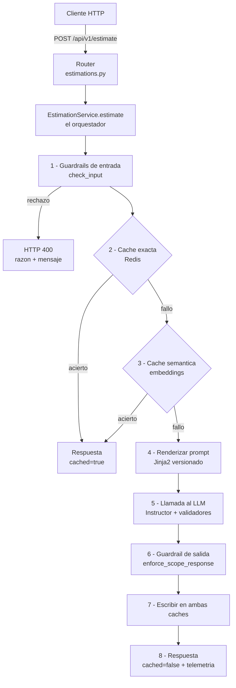
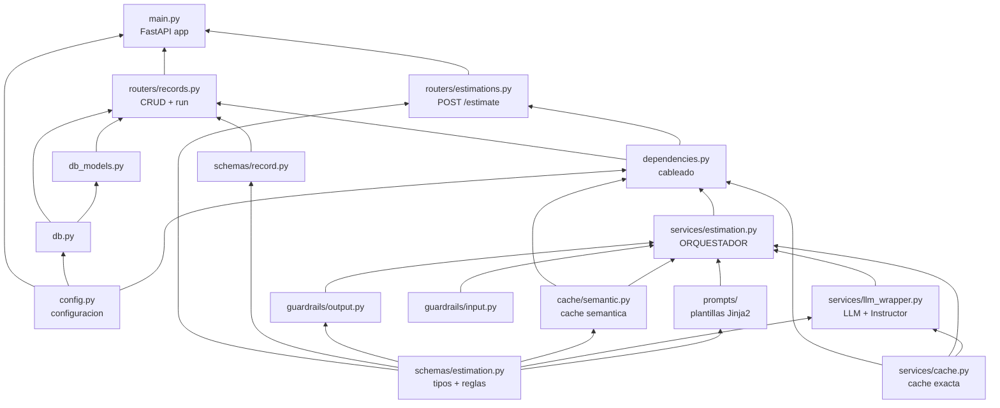

# El estimator por dentro: guía del código pieza a pieza

> Esta guía explica **solo el backend del estimator** (la carpeta `estimator/`), no la
> aplicación web de Angular. Está escrita para que alguien con conocimientos técnicos
> básicos pueda leerla de principio a fin y entender no solo *qué* hace cada archivo,
> sino *por qué* está ahí y *de qué depende*.

## Cómo leer este documento

El código tiene muchas piezas que se apoyan unas en otras. Si las explicáramos en el
orden en que se ejecutan (de arriba abajo), constantemente mencionaríamos cosas que
todavía no hemos visto. Por eso seguimos un **hilo argumental de abajo hacia arriba**:
primero los cimientos (configuración y tipos de datos), luego las herramientas que se
construyen sobre ellos (prompts, LLM, cachés, guardrails), después el orquestador que
las une, y por último la capa HTTP y el arranque.

Cuando lleguemos a una pieza, todas sus dependencias ya estarán explicadas.

---

## Índice

1. [Visión general: qué es y qué hace](#1-visión-general)
2. [Mapa de archivos](#2-mapa-de-archivos)
3. [El recorrido de una estimación](#3-el-recorrido-de-una-estimación)
4. [Cimiento 1 — Configuración (`config.py`)](#4-cimiento-1--configuración)
5. [Cimiento 2 — El contrato de datos (`schemas/estimation.py`)](#5-cimiento-2--el-contrato-de-datos)
6. [Herramienta 1 — Los prompts versionados (`prompts/`)](#6-herramienta-1--los-prompts-versionados)
7. [Herramienta 2 — El wrapper del LLM (`services/llm_wrapper.py`)](#7-herramienta-2--el-wrapper-del-llm)
8. [Herramienta 3 — Las dos cachés (`services/cache.py`, `cache/semantic.py`)](#8-herramienta-3--las-dos-cachés)
9. [Herramienta 4 — Los guardrails (`guardrails/`)](#9-herramienta-4--los-guardrails)
10. [El orquestador (`services/estimation.py`)](#10-el-orquestador)
11. [El cableado: inyección de dependencias (`dependencies.py`)](#11-el-cableado-inyección-de-dependencias)
12. [Persistencia: base de datos (`db.py`, `db_models.py`)](#12-persistencia-base-de-datos)
13. [La capa HTTP (`schemas/record.py`, `routers/`)](#13-la-capa-http)
14. [El arranque de la aplicación (`main.py`)](#14-el-arranque-de-la-aplicación)
15. [Cómo se ejecuta: entorno y Docker](#15-cómo-se-ejecuta-entorno-y-docker)
16. [Mapa de dependencias completo](#16-mapa-de-dependencias-completo)
17. [Memoria conversacional y adjuntos — sesión 5 (`sessions/`, `attachments/`)](#17-memoria-conversacional-y-adjuntos--sesión-5)

---

## 1. Visión general

El **estimator** es un servicio que recibe la **descripción de un proyecto de software**
(por ejemplo: *"una app móvil para reparto de comida con pagos por Stripe"*) y devuelve
una **estimación estructurada**: fases del proyecto, semanas de duración, coste en euros
y un nivel de confianza.

Por dentro es una **API HTTP** construida con FastAPI que, cuando recibe una petición,
ejecuta una **tubería (pipeline)** de pasos:

1. **Comprueba la entrada** (que no sea contenido ofensivo, un intento de manipular al
   modelo, ni datos personales).
2. **Busca en caché** si ya respondió algo igual o muy parecido (para no pagar otra
   llamada al modelo).
3. Si no hay caché, **construye las instrucciones** (el *prompt*) y **llama a un modelo
   de lenguaje** (LLM, p. ej. GPT-4o-mini o Claude Haiku).
4. **Valida la respuesta** contra reglas de negocio (que las fases sumen el total, etc.).
5. **Guarda el resultado** en caché y, opcionalmente, en una base de datos.

Hay dos formas de usarlo:

- **Sin estado** (`POST /api/v1/estimate`): mandas la descripción, recibes la estimación.
  Nada se guarda.
- **Con estado / CRUD** (`/api/v1/estimations`): creas una "ficha" de estimación, la
  editas, la ejecutas, la consultas y la borras. Aquí sí se persiste en Postgres y se
  guarda telemetría (tokens, coste, latencia).

> **Conceptos clave que aparecerán** (definidos al vuelo cuando toque):
> *LLM*, *prompt*, *salida estructurada*, *embedding*, *caché*, *TTL*, *guardrail*,
> *inyección de dependencias*, *ORM*.

---

## 2. Mapa de archivos

```
estimator/
├── app/
│   ├── main.py                 # Arranque de FastAPI: app, CORS, logging, /health
│   ├── config.py               # Configuración (lee variables de entorno y .env)
│   ├── dependencies.py         # Cablea los objetos compartidos (singletons)
│   │
│   ├── schemas/
│   │   ├── estimation.py       # Contrato de datos: entrada, resultado, reglas de negocio
│   │   └── record.py           # Contrato de datos de la API CRUD (fichas persistidas)
│   │
│   ├── prompts/
│   │   ├── loader.py           # Renderiza plantillas Jinja2 versionadas
│   │   └── estimation/v1/
│   │       ├── system.j2       # Instrucciones del "sistema" (rol, reglas, formato)
│   │       ├── user.j2         # Mensaje del usuario (la descripción)
│   │       └── examples.j2     # Ejemplos de calibración (técnica CAG)
│   │
│   ├── services/
│   │   ├── llm_wrapper.py      # Llama al LLM: fallback, salida estructurada, coste
│   │   ├── cache.py            # Caché exacta (Redis, clave SHA-256)
│   │   └── estimation.py       # ORQUESTADOR: une todas las piezas (el pipeline)
│   │
│   ├── cache/
│   │   └── semantic.py         # Caché semántica (similitud por embeddings)
│   │
│   ├── guardrails/
│   │   ├── input.py            # Filtros de entrada: moderación, inyección, PII
│   │   └── output.py           # Filtro de salida: normaliza respuestas de baja confianza
│   │
│   ├── routers/
│   │   ├── estimations.py      # Endpoint sin estado: POST /api/v1/estimate
│   │   └── records.py          # Endpoints CRUD + ciclo de vida: /api/v1/estimations
│   │
│   ├── db.py                   # Motor SQLAlchemy + sesión + creación de tablas
│   └── db_models.py            # Modelo ORM de una estimación persistida
│
├── tests/                      # Suite de pruebas (no se cubre en esta guía)
├── pyproject.toml              # Dependencias del proyecto y configuración de tooling
├── .env.example                # Plantilla de variables de entorno
├── docker-compose.yml          # Orquesta estimator + Redis + Postgres
└── Dockerfile                  # Imagen de producción (multi-stage)
```

Quédate con tres carpetas mentalmente:

- **`schemas/`** = las *formas* de los datos (qué campos, qué tipos, qué reglas).
- **`services/` + `cache/` + `guardrails/` + `prompts/`** = las *herramientas*.
- **`routers/` + `main.py`** = la *puerta de entrada* HTTP.

---

## 3. El recorrido de una estimación

Antes de bajar al detalle, este es el camino que recorre una petición de estimación. Es
el **hilo argumental** del resto del documento: cada caja es una pieza que explicaremos.



El orden no es casual:

- Los **guardrails van primero**: una descripción maliciosa o con datos personales no
  debe servirse nunca desde caché.
- La **caché exacta va antes que la semántica** porque es la más barata (no necesita
  llamar a la API de *embeddings*).
- La **escritura en caché va después de validar la salida**: nunca cacheamos una
  estimación que no pasó las reglas.

Ahora construimos cada pieza de abajo hacia arriba.

---

## 4. Cimiento 1 — Configuración

**Archivo:** `app/config.py`
**Depende de:** nada del propio proyecto (solo de `pydantic-settings`).

Todo el sistema necesita saber cosas: ¿qué modelo usamos?, ¿dónde está Redis?, ¿cuál es
la clave de la API? Esto se centraliza en una clase `Settings`.

```python
class Settings(BaseSettings):
    model_config = SettingsConfigDict(env_file=".env", ...)

    OPENAI_API_KEY: str | None = None
    ANTHROPIC_API_KEY: str | None = None
    PRIMARY_MODEL: str = "gpt-4o-mini"
    FALLBACK_MODEL: str = "claude-haiku-4-5-20251001"
    REDIS_URL: str = "redis://localhost:6379"
    DATABASE_URL: str = "postgresql+psycopg2://..."
    SEMANTIC_CACHE_THRESHOLD: float = 0.85
    ...
```

**Qué es `BaseSettings`:** una clase de la librería *pydantic-settings* que rellena sus
campos automáticamente leyendo **variables de entorno** y, si existe, un archivo `.env`.
Si defines `PRIMARY_MODEL` en el entorno, ese valor gana sobre el valor por defecto del
código. Es la forma estándar de configurar un servicio sin tocar el código.

Dos detalles importantes:

- **Validación de claves.** Hay un validador que exige que esté presente *al menos una*
  clave de API (OpenAI o Anthropic). Si faltan las dos, el servicio se niega a arrancar
  con un error claro en vez de fallar más tarde, en mitad de una petición:

  ```python
  @model_validator(mode="after")
  def validate_at_least_one_api_key(self) -> "Settings":
      if not self.OPENAI_API_KEY and not self.ANTHROPIC_API_KEY:
          raise ValueError("At least one of OPENAI_API_KEY or ANTHROPIC_API_KEY must be set")
      return self
  ```

- **Singleton cacheado.** `get_settings()` está decorado con `@lru_cache`, lo que
  significa que la configuración se construye **una sola vez** y se reutiliza. Todas las
  demás piezas llaman a `get_settings()` y obtienen siempre el mismo objeto.

  > **`@lru_cache` en una frase:** "recuerda el resultado de esta función y, la próxima
  > vez que la llamen igual, devuélvelo sin recalcular". Aplicado a una función sin
  > argumentos, lo convierte en un *singleton* (una única instancia para todo el programa).

> **Nota sobre campos heredados:** verás campos como `LLM_PROVIDER` y `LLM_MODEL`
> marcados como *"Session 2, backwards compatibility"*. Son de una versión anterior del
> proyecto; el pipeline actual usa `PRIMARY_MODEL`/`FALLBACK_MODEL`. Se mantienen para
> no romper demos antiguas.

---

## 5. Cimiento 2 — El contrato de datos

**Archivo:** `app/schemas/estimation.py`
**Depende de:** `pydantic`.

Este archivo es el **corazón conceptual** del estimator. Define *qué forma* tienen los
datos que entran y salen, y —lo más interesante— **las reglas de negocio que el modelo
de lenguaje no puede saltarse**.

Todo se construye con **Pydantic**, una librería que define clases con tipos y, cuando
recibe datos, los valida automáticamente. Si los datos no encajan, Pydantic lanza un
error en lugar de dejar pasar basura.

### 5.1 Las opciones cerradas (Enums)

```python
class ProjectType(str, Enum):
    MOBILE_APP = "mobile_app"
    WEB_SAAS = "web_saas"
    INTERNAL_TOOL = "internal_tool"
    DATA_PIPELINE = "data_pipeline"
```

Un **Enum** es una lista cerrada de valores válidos. El tipo de proyecto solo puede ser
uno de esos cuatro; cualquier otro valor se rechaza. Lo mismo para `DetailLevel`
(summary/medium/detailed) y `OutputFormat` (tabla/lista/narrativa).

### 5.2 La petición de entrada

```python
class EstimationRequest(BaseModel):
    description: str = Field(min_length=20, max_length=80000, ...)
    project_type: ProjectType
    detail_level: DetailLevel
    output_format: OutputFormat
```

Esto es lo que el cliente debe enviar. La descripción tiene que medir entre 20 y 80.000
caracteres: demasiado corta no se puede estimar, demasiado larga es sospechosa o
costosa. `project_type`, `detail_level` y `output_format` solo aceptan los valores de
sus Enums.

### 5.3 El resultado estructurado

```python
class Phase(BaseModel):
    name: str = Field(min_length=1, max_length=64)
    duration_weeks: int = Field(ge=1, le=52)
    cost_eur: int = Field(ge=0, le=1_000_000)
    summary: str = Field(min_length=10, max_length=600)

class EstimationResult(BaseModel):
    summary: str
    confidence_pct: int = Field(ge=0, le=100)
    phases: list[Phase] = Field(min_length=1, max_length=8)
    total_duration_weeks: int
    total_cost_eur: int
```

`EstimationResult` es la estimación final: un resumen, un porcentaje de confianza, una
lista de fases (entre 1 y 8) y los totales. `Field(ge=..., le=...)` impone mínimos y
máximos (`ge` = *greater or equal*, `le` = *less or equal*).

**Un detalle muy sutil pero deliberado: el orden de los campos.** Las `phases` se
declaran *antes* que los totales. ¿Por qué importa? Porque un LLM genera texto palabra a
palabra, en orden. Si le pides los totales primero, tiende a elegir un número redondo
("50.000 €") y luego intenta inventar fases que sumen eso, cosa que hace fatal
aritméticamente. Si genera primero las fases, solo tiene que **sumarlas** al final. El
comentario del código lo explica explícitamente.

### 5.4 Las reglas que el LLM no puede romper (validadores)

Aquí está la idea más potente del archivo. Dos `@model_validator` comprueban reglas de
negocio **después** de que el modelo responda:

```python
@model_validator(mode="after")
def phases_sum_matches_total(self) -> "EstimationResult":
    phase_sum = sum(p.cost_eur for p in self.phases)
    if phase_sum != self.total_cost_eur:
        raise ValueError(f"phases sum ({phase_sum} EUR) does not match total_cost_eur ...")
    return self

@model_validator(mode="after")
def low_confidence_requires_out_of_scope_prefix(self) -> "EstimationResult":
    if self.confidence_pct < 30 and not self.summary.startswith("Out of scope:"):
        raise ValueError("confidence_pct < 30 requires summary to start with 'Out of scope:' ...")
    return self
```

- **Regla 1:** la suma de los costes de las fases tiene que ser *exactamente* igual al
  total. Si el modelo se equivoca al sumar, el validador lanza un `ValueError`.
- **Regla 2:** si la confianza es baja (< 30%), el modelo está obligado a admitirlo
  empezando el resumen con `"Out of scope:"`. No puede dar una cifra con seguridad
  fingida sobre algo que no entiende.

**¿Y qué pasa cuando un validador falla?** Aquí entra en juego una librería que veremos
en la sección 7 (*Instructor*): cuando el validador lanza el error, ese mensaje de error
se le **devuelve al modelo** y se le pide que lo intente de nuevo. El modelo lee *"tus
fases suman 48.000 pero pusiste 50.000"* y se corrige. Esto se repite hasta que acierta
(o hasta agotar los reintentos). Es decir: **las reglas de Python disciplinan al LLM**.

### 5.5 Telemetría y envoltorio de respuesta

```python
class LlmUsage(BaseModel):
    input_tokens: int = 0
    output_tokens: int = 0
    total_tokens: int = 0
    cost_usd: float = 0.0
    latency_ms: int | None = None
    finish_reason: str | None = None

class EstimationResponse(BaseModel):
    result: EstimationResult
    prompt_version: str
    cached: bool = False
    usage: LlmUsage | None = None
```

`EstimationResponse` es lo que devuelve la API: el resultado, **qué versión del prompt**
lo produjo, si vino de **caché** (`cached`), y la **telemetría** de la llamada (`usage`:
tokens consumidos, coste en dólares, latencia). Cuando la respuesta sale de caché no hubo
llamada al modelo, así que `usage` es `None`.

---

## 6. Herramienta 1 — Los prompts versionados

**Archivos:** `app/prompts/loader.py` + `app/prompts/estimation/v1/*.j2`
**Depende de:** `jinja2`, `schemas/estimation.py`.

El "prompt" son las **instrucciones que se le dan al LLM**. En lugar de tenerlas
incrustadas en el código Python, viven en archivos de plantilla `.j2` (**Jinja2**) y se
organizan por **versión**.

### 6.1 El cargador

```python
def render_estimation_prompt(request, version="v1") -> tuple[str, str]:
    context = {
        "description": request.description,
        "project_type": request.project_type.value,
        "detail_level": request.detail_level.value,
        "output_format": request.output_format.value,
    }
    system = _env.get_template(f"estimation/{version}/system.j2").render(**context)
    user = _env.get_template(f"estimation/{version}/user.j2").render(**context)
    return system, user
```

**Qué es Jinja2:** un motor de plantillas. Tú escribes texto con "huecos" (`{{ description }}`)
y condicionales (``), y al *renderizar* le pasas valores que rellenan los
huecos. El resultado es texto plano listo para enviar al modelo.

Devuelve **dos** textos:

- El **`system`**: el rol y las reglas (quién es el modelo, qué debe hacer, en qué
  formato). Es la "personalidad" e instrucciones fijas.
- El **`user`**: el mensaje concreto del usuario (la descripción del proyecto).

> **Por qué versionar (`v1`, `v2`...).** Cambiar el prompt es la palanca más potente para
> mejorar las respuestas. Al guardarlos en carpetas por versión, cambiar de prompt es
> cambiar un parámetro (`version="v2"`) en vez de reescribir código. Y como
> `EstimationResponse` guarda `prompt_version`, siempre sabes con qué instrucciones se
> generó cada estimación.

Un matiz técnico: el entorno Jinja2 usa `StrictUndefined`, que hace **fallar** la
plantilla si te falta una variable, en vez de dejar un hueco vacío silencioso. Mejor un
error ruidoso que un prompt a medio rellenar.

### 6.2 La plantilla `system.j2`

Es el archivo más "de negocio" de todo el proyecto. Define al modelo como *"un estimador
senior con 15+ años de experiencia"* y fija:

- **Tarifas y supuestos** (62,50 €/h desarrollador, una semana = 32 horas productivas...).
- **Formato de salida** según `output_format` (un bloque `` distinto para tabla,
  lista o narrativa).
- **Profundidad** según `detail_level`.
- **Reglas duras** repetidas en lenguaje natural: *"total_cost_eur debe ser igual a la
  suma de las fases"*, *"si confianza < 30, empieza con Out of scope:"*. Son las mismas
  reglas que los validadores de la sección 5.4 — **se le dicen al modelo por adelantado**
  y, si aun así falla, los validadores las imponen por la fuerza.

### 6.3 La plantilla `examples.j2` (técnica CAG)

`system.j2` termina con ``, que inyecta **tres
ejemplos completos** de estimaciones bien hechas (un SaaS B2B, una app móvil, una
herramienta interna).

Esto es **CAG (Context-Augmented Generation)**: en lugar de solo *describir* lo que
quieres, le *muestras* ejemplos del nivel de rigor y el tono esperados. El propio texto
avisa al modelo: *"no copies estos números, úsalos solo como ancla de calibración"*. Los
ejemplos hacen que la primera respuesta del modelo sea mucho más consistente.

---

## 7. Herramienta 2 — El wrapper del LLM

**Archivo:** `app/services/llm_wrapper.py`
**Depende de:** `litellm`, `instructor`, `services/cache.py`.

Esta clase es la que **habla con el modelo de lenguaje**. Encapsula cuatro cosas que no
quieres repetir en cada llamada: elegir proveedor, obtener salida estructurada, calcular
el coste y registrar logs.

### 7.1 El problema que resuelve

Hay varios proveedores de LLM (OpenAI, Anthropic) con APIs distintas. Para no escribir
código específico de cada uno, se usa **LiteLLM**, una librería que ofrece *una sola
interfaz* para todos. Le pides `model="gpt-4o-mini"` o `model="claude-haiku-4-5"` y ella
se encarga de hablar con el proveedor correcto.

### 7.2 El Router y el fallback

```python
self.router = Router(
    model_list=[
        {"model_name": "estimator", "litellm_params": {"model": primary_model, ...}},
        {"model_name": "estimator", "litellm_params": {"model": fallback_model, ...}},
    ],
    fallbacks=[{"estimator": ["estimator"]}],
    num_retries=num_retries,
)
```

El `Router` de LiteLLM agrupa **dos modelos bajo el mismo nombre lógico** (`"estimator"`):
el primario y el de reserva. Si el primario falla (caído, timeout), LiteLLM cambia
automáticamente al de reserva sin que el código que llama se entere. Esto da
**tolerancia a fallos** entre proveedores.

> **Matiz importante y fácil de pasar por alto.** El Router (con su fallback automático)
> solo lo usa el método `complete()`, que es la versión "antigua" de texto libre que se
> mantiene para los tests. El pipeline real usa `complete_structured()` (siguiente
> apartado), que llama directamente con `primary_model` y **no** pasa por el Router. Es
> decir: en la práctica el camino estructurado usa el modelo primario y se apoya en los
> reintentos de Instructor, no en el fallback entre proveedores.

### 7.3 Salida estructurada con Instructor — el método clave

```python
self._instructor = instructor.from_litellm(litellm.completion)

def complete_structured(self, *, system_prompt, user_message, response_model, ...):
    result, completion = self._instructor.chat.completions.create_with_completion(
        model=target_model,
        messages=[...],
        response_model=response_model,   # <-- EstimationResult
        max_retries=max_retries,
    )
```

Aquí ocurre la magia que conecta con la sección 5. **Instructor** es una librería que
envuelve la llamada al LLM y le añade un superpoder: en vez de devolver texto suelto,
devuelve **un objeto Pydantic ya validado**.

El flujo es:

1. Le pasas `response_model=EstimationResult`.
2. Instructor le pide al modelo que responda con esa estructura.
3. Cuando el modelo responde, Instructor intenta construir el `EstimationResult` — lo que
   **dispara los validadores** de la sección 5.4.
4. Si un validador lanza un `ValueError`, Instructor **le reenvía ese error al modelo** y
   le pide otro intento, hasta `max_retries` veces.
5. Cuando todo cuadra, devuelve el objeto validado.

Por eso `complete_structured` devuelve una **tupla** `(result, meta)`: el resultado
validado *y* los metadatos. Usa `create_with_completion` (en lugar del `create`
habitual de Instructor) precisamente porque ese método también devuelve la respuesta
cruda, de donde se leen los **tokens consumidos** (el `create` normal los descarta).

> Detalle honesto que el propio código comenta: en un bucle de reintentos, los tokens
> reportados son los de la **última** llamada exitosa, no la suma de todos los intentos.

### 7.4 Cálculo de coste

```python
MODEL_COSTS = {
    "gpt-4o-mini": {"input": 0.15, "output": 0.60},
    "claude-haiku-4-5": {"input": 1.00, "output": 5.00},
    ...
}

def _estimate_cost(model, tokens_in, tokens_out) -> float:
    costs = MODEL_COSTS.get(...) or {"input": 0.0, "output": 0.0}
    return round((tokens_in * costs["input"] + tokens_out * costs["output"]) / 1_000_000, 6)
```

Una tabla con el precio por millón de tokens de cada modelo. A partir de los tokens de
entrada y salida calcula cuánto costó la llamada en dólares. Esto alimenta la telemetría
(`cost_usd`) que se guarda y se enseña en la UI.

> **Token, en una frase:** la unidad en la que los modelos cuentan texto (≈ ¾ de una
> palabra en inglés). Se cobra por token de entrada y por token de salida, normalmente a
> precios distintos.

### 7.5 Funciones auxiliares

- `_normalise_model_name`: quita prefijos como `anthropic/` que LiteLLM a veces añade.
- `_provider_from_model`: deduce el proveedor mirando el nombre (`claude...` → Anthropic,
  `gpt...`/`o1`/`o3` → OpenAI). Sirve para elegir la clave de API correcta y para etiquetar
  la telemetría.

---

## 8. Herramienta 3 — Las dos cachés

Llamar a un LLM cuesta dinero y tiempo. Si dos peticiones son iguales (o muy parecidas),
mejor reutilizar la respuesta. El estimator tiene **dos cachés en capas**, ambas sobre
**Redis** (una base de datos en memoria, rapidísima, que guarda pares clave→valor).

### 8.1 Caché exacta

**Archivo:** `app/services/cache.py`
**Depende de:** `redis`.

Guarda respuestas indexadas por una **clave determinista**: si dos peticiones producen la
misma clave, comparten respuesta.

```python
@staticmethod
def make_key(*, system_prompt, user_message, model, max_tokens, thinking_budget) -> str:
    payload = json.dumps({...}, sort_keys=True)
    digest = hashlib.sha256(payload.encode("utf-8")).hexdigest()
    return f"estimation:{digest}"
```

La clave es un **hash SHA-256** (una "huella digital" de longitud fija) del contenido. La
gracia: si cambias el prompt, el modelo o cualquier parámetro, el hash cambia y por tanto
la entrada antigua deja de usarse **automáticamente**, sin tener que vaciar la caché a
mano.

Los métodos son los esperables, con una característica defensiva importante:

```python
def get(self, key):
    try:
        cached = self.redis.get(key)
    except redis.RedisError as exc:
        log.warning("cache_get_failed", error=str(exc))
        return None   # si Redis falla, seguimos como si no hubiera caché
```

Si Redis se cae, la caché **falla en silencio** (`return None`) en vez de tumbar el
servicio: simplemente se comporta como si no hubiera nada cacheado. `set` usa `setex`,
que guarda con un **TTL** (*time to live*): la entrada se autodestruye pasado un tiempo
(por defecto 86.400 s = 24 h). `delete` borra una clave concreta (lo usa la
reestimación).

> **Ojo a un matiz de diseño:** esta clase `EstimationCache` tiene su propio
> `make_key`, pero el pipeline real **no** lo usa para cachear el resultado estructurado.
> El orquestador (sección 10) calcula *su propia* clave (`_exact_cache_key`, con prefijo
> `estimation:v2:`) sobre la petición tipada. La `make_key` de aquí solo la usa el método
> `complete()` legacy del wrapper.

### 8.2 Caché semántica

**Archivo:** `app/cache/semantic.py`
**Depende de:** `redisvl`, `numpy`, una API de *embeddings* (OpenAI), `schemas/estimation.py`.

La caché exacta solo acierta si la petición es *idéntica*. Pero *"app de reparto de
comida"* y *"aplicación para delivery de comida"* deberían dar lo mismo. Para eso está la
**caché semántica**: encuentra respuestas de peticiones **parecidas en significado**.

**Cómo funciona, en dos ideas:**

1. **Embeddings.** Un *embedding* es la descripción convertida en un **vector** (una lista
   de 1.536 números) que captura su significado. Textos parecidos producen vectores
   cercanos. Esa conversión la hace un modelo aparte (`text-embedding-3-small`).

2. **Similitud del coseno.** Para saber si dos vectores son "cercanos" se mide el ángulo
   entre ellos (similitud del coseno): 1.0 = idénticos, 0.0 = sin relación. Si la
   similitud supera un **umbral** (`SEMANTIC_CACHE_THRESHOLD`, configurado en 0.85), se
   considera el mismo proyecto y se sirve la respuesta guardada.

```python
def lookup(self, request, prompt_version):
    bucket = self.bucket_for(request, prompt_version)
    embedding = self.vectorizer.embed(request.description)
    query = VectorQuery(
        vector=_to_bytes(embedding),
        filter_expression=Tag("bucket") == bucket,   # mismo "cajón"
        num_results=1, return_score=True,
    )
    results = self.index.query(query)
    ...
    similarity = 1.0 - distance
    if similarity < self.threshold:
        return None   # demasiado distinto: fallo de caché
```

**El "bucket" (cajón).** Antes de comparar por significado, se exige que coincida
*exactamente* un identificador compuesto:
`prompt_version : project_type : detail_level : output_format`. Es decir, una estimación
"detallada en formato tabla de un SaaS web" nunca se sirve para una petición "resumida en
narrativa", **aunque la descripción sea idéntica** — porque el prompt sería distinto y la
respuesta debería serlo también. El bucket primero, el significado después.

Otras piezas:

- **`store`** guarda el resultado (como JSON), el bucket y el embedding, con TTL.
- **`delete_bucket`** borra todas las entradas de un bucket (lo usa la reestimación).
- **Modo `log_only`.** Si está activo, la caché hace la búsqueda y *registra* qué habría
  acertado, pero **no sirve** el resultado. Sirve para **calibrar el umbral** con tráfico
  real antes de encenderla de verdad en producción.

> **Requisito de infraestructura.** Esta caché necesita **Redis Stack** (con el módulo
> RediSearch para búsquedas vectoriales), no el Redis normal. Por eso el `docker-compose`
> usa la imagen `redis/redis-stack`. Si no estuviera disponible, el sistema sigue
> funcionando sin caché semántica (lo veremos en la sección 11).

---

## 9. Herramienta 4 — Los guardrails

Los *guardrails* ("barandillas") son controles de seguridad y calidad. Hay dos grupos:
los de **entrada** (antes de llamar al modelo) y los de **salida** (después).

### 9.1 Guardrails de entrada

**Archivo:** `app/guardrails/input.py`
**Depende de:** `re` (expresiones regulares), opcionalmente un cliente OpenAI.

`check_input` ejecuta **tres capas en orden** y lanza una excepción
`InputGuardrailViolation` en la primera que falle:

```python
def check_input(description, *, openai_client=None) -> None:
    if openai_client is not None:
        _check_moderation(description, openai_client)
    _check_prompt_injection(description)
    _check_pii(description)
```

1. **Moderación.** Llama a la *Moderation API* de OpenAI, que detecta contenido de odio,
   violencia, sexual, etc. Si está marcado, se rechaza. Si la llamada falla (red, auth),
   **falla en abierto** (lo registra y deja pasar) para no bloquear el servicio por un
   problema de red.

2. **Inyección de prompts.** Una batería de expresiones regulares detecta intentos de
   manipular al modelo: *"ignore previous instructions"*, *"you are now..."*,
   etiquetas falsas `<system>`, etc. Es una defensa barata y rápida.

3. **PII (datos personales).** Expresiones regulares que detectan emails, IBANs y
   teléfonos. El propio código aclara que **no es exhaustivo a propósito**: es una
   demostración del *patrón*, no un redactor con grado de cumplimiento legal.

```python
class InputGuardrailViolation(Exception):
    def __init__(self, message, *, reason):   # reason: "moderation" | "prompt_injection" | "pii"
        ...
        self.reason = reason
```

La excepción lleva un campo `reason`. Esto es clave: permite que la capa HTTP devuelva un
**código y un mensaje específicos** según *por qué* se rechazó (lo veremos en la sección 13).

> **Política importante:** los guardrails de entrada **rechazan** (lanzan excepción),
> nunca "arreglan y reintentan". Una entrada con datos personales no se limpia
> silenciosamente: se devuelve al usuario para que la corrija.

### 9.2 Guardrail de salida

**Archivo:** `app/guardrails/output.py`
**Depende de:** `schemas/estimation.py`.

```python
def enforce_scope_response(result: EstimationResult) -> EstimationResult:
    is_low_confidence = result.confidence_pct < LOW_CONFIDENCE_THRESHOLD
    already_marked = result.summary.startswith(OUT_OF_SCOPE_PREFIX)
    if not is_low_confidence or already_marked:
        return result
    # reescribe el resultado como "Out of scope:" con una fase placeholder
    ...
```

A diferencia de los de entrada, este es un **filtro**, no una excepción: **nunca falla**,
siempre devuelve un `EstimationResult` bien formado. Si detecta una respuesta de baja
confianza que *no* se declaró como "fuera de alcance", la reescribe para que sí lo haga.

> En la práctica, el validador de la sección 5.4 ya habría obligado al modelo a marcarlo
> antes de llegar aquí. Este filtro es un **cinturón y tirantes**: cubre el caso límite
> (`confidence_pct == 30` exacto) o un futuro relajamiento del umbral. Filosofía:
> entrada → rechazar; salida → corregir suavemente para que el usuario reciba un mensaje
> claro en lugar de un error.

---

## 10. El orquestador

**Archivo:** `app/services/estimation.py`
**Depende de:** **todas** las herramientas anteriores (guardrails, ambas cachés, prompts,
wrapper del LLM, schemas).

Esta es la pieza que **une todo**. Es la implementación literal del diagrama de la
sección 3. El router (la capa HTTP) no contiene nada de esta lógica; solo traduce
errores. Toda la inteligencia del pipeline vive aquí.

### 10.1 La clave de la caché exacta

```python
def _exact_cache_key(request, prompt_version, model) -> str:
    payload = json.dumps({
        "description": request.description,
        "project_type": request.project_type.value,
        "detail_level": request.detail_level.value,
        "output_format": request.output_format.value,
        "prompt_version": prompt_version,
        "model": model,
    }, sort_keys=True)
    return f"estimation:v2:{hashlib.sha256(payload.encode()).hexdigest()}"
```

La clave incluye la petición completa **más** la versión del prompt **y** el modelo. Así,
cambiar de prompt o de modelo invalida la caché de forma natural.

### 10.2 El pipeline, paso a paso

```python
def estimate(self, request: EstimationRequest) -> EstimationResponse:
    # 1. Guardrails de entrada (lanza InputGuardrailViolation si rechaza)
    check_input(request.description, openai_client=self.openai_client)

    # 2. Caché exacta
    cache_key = _exact_cache_key(request, self.prompt_version, self.llm_wrapper.primary_model)
    cached = self.exact_cache.get(cache_key)
    if cached:
        return EstimationResponse(result=..., cached=True)

    # 3. Caché semántica
    if self.semantic_cache is not None:
        semantic_hit = self.semantic_cache.lookup(request, self.prompt_version)
        if semantic_hit is not None:
            return EstimationResponse(result=semantic_hit, cached=True)

    # 4. Renderizar el prompt versionado
    system_prompt, user_message = render_estimation_prompt(request, version=self.prompt_version)

    # 5. Llamada al LLM con Instructor + validadores
    result, meta = self.llm_wrapper.complete_structured(
        system_prompt=system_prompt, user_message=user_message,
        response_model=EstimationResult,
    )

    # 6. Guardrail de salida (filtro)
    result = enforce_scope_response(result)

    # 7. Escribir en AMBAS cachés (solo lo ya validado)
    self.exact_cache.set(cache_key, {"result": result.model_dump(mode="json"), ...})
    if self.semantic_cache is not None:
        self.semantic_cache.store(request, result, self.prompt_version)

    # 8. Devolver con telemetría
    usage = LlmUsage(input_tokens=meta["input_tokens"], cost_usd=meta["cost_usd"], ...)
    return EstimationResponse(result=result, cached=False, usage=usage)
```

Cada número se corresponde con una caja del diagrama. Fíjate en cómo el orquestador **no
sabe los detalles** de cada herramienta: llama a `check_input`, a `lookup`, a
`complete_structured`... y cada herramienta hace su trabajo. Esto es **separación de
responsabilidades**: si mañana cambias cómo funciona la caché semántica, el orquestador
no se entera.

### 10.3 Invalidación para reestimar

```python
def invalidate_caches(self, request: EstimationRequest) -> None:
    cache_key = _exact_cache_key(request, self.prompt_version, self.llm_wrapper.primary_model)
    self.exact_cache.delete(cache_key)
    if self.semantic_cache is not None:
        self.semantic_cache.delete_bucket(request, self.prompt_version)
```

Cuando el usuario edita una ficha y pide reestimarla, hay que **borrar las dos cachés**
para esa petición; si no, le devolveríamos la respuesta antigua. Esto lo invoca el
endpoint `run` con `?reestimate=true` (sección 13).

---

## 11. El cableado: inyección de dependencias

**Archivo:** `app/dependencies.py`
**Depende de:** config + todas las herramientas + el orquestador.

Hasta ahora hemos visto piezas que reciben sus dependencias "ya construidas" (el
orquestador recibe un `llm_wrapper`, un `exact_cache`...). ¿Quién las construye y se las
pasa? Este archivo.

Es el patrón de **inyección de dependencias** de FastAPI: funciones-fábrica que crean los
objetos compartidos una sola vez (de nuevo con `@lru_cache`, así son *singletons*) y que
FastAPI inyecta en los endpoints cuando hacen falta.

```python
@lru_cache
def get_cache() -> EstimationCache:
    settings = get_settings()
    return EstimationCache.from_url(settings.REDIS_URL, ttl=settings.CACHE_TTL)

@lru_cache
def get_llm_wrapper() -> LLMWrapper:
    settings = get_settings()
    return LLMWrapper(openai_api_key=..., primary_model=settings.PRIMARY_MODEL, cache=get_cache(), ...)

@lru_cache
def get_estimation_service() -> EstimationService:
    return EstimationService(
        llm_wrapper=get_llm_wrapper(),
        exact_cache=get_cache(),
        semantic_cache=get_semantic_cache(),
        openai_client=get_openai_client(),
    )
```

Observa cómo las fábricas se llaman entre sí: `get_estimation_service` pide
`get_llm_wrapper`, que a su vez pide `get_cache`. Así se monta el árbol completo de
dependencias a partir de la configuración.

**Degradación elegante (lo más interesante de este archivo).** Dos dependencias pueden
fallar sin tumbar el servicio:

```python
@lru_cache
def get_openai_client() -> OpenAI | None:
    settings = get_settings()
    if not settings.OPENAI_API_KEY:
        return None        # sin clave de OpenAI → no hay moderación ni embeddings

@lru_cache
def get_semantic_cache() -> EstimationSemanticCache | None:
    ...
    try:
        ... return EstimationSemanticCache(...)
    except Exception:
        log.warning("semantic_cache_disabled", reason="setup_failed")
        return None        # sin Redis Stack → el pipeline sigue sin caché semántica
```

Si no hay clave de OpenAI, no hay moderación ni caché semántica, pero el resto funciona.
Si Redis no es "Stack" (no soporta vectores), la caché semántica se desactiva con un aviso
en el log y el servicio sigue vivo. Por eso a lo largo del código verás tantos
`if self.semantic_cache is not None:` — la pieza puede no existir, y todo está preparado
para ese caso.

---

## 12. Persistencia: base de datos

La parte "sin estado" no guarda nada. La parte CRUD sí: guarda fichas de estimación en
**Postgres** usando **SQLAlchemy** (un *ORM*, una librería que traduce entre objetos de
Python y filas de una tabla SQL).

### 12.1 Motor y sesión

**Archivo:** `app/db.py`

```python
class Base(DeclarativeBase):
    pass

def _init():
    global _engine, _SessionLocal
    if _engine is None:
        url = get_settings().DATABASE_URL
        _engine = create_engine(url, pool_pre_ping=True, ...)
        _SessionLocal = sessionmaker(bind=_engine, ...)
    return _engine, _SessionLocal
```

- **`Base`** es la clase de la que heredan todos los modelos ORM.
- **El motor (`engine`) se crea de forma perezosa** (*lazy*): hasta que no se necesita de
  verdad, no se abre ninguna conexión. Esto permite que los tests que no usan base de
  datos arranquen la app sin Postgres.
- `pool_pre_ping=True` comprueba que la conexión sigue viva antes de usarla (evita errores
  por conexiones caducadas).

```python
def get_db() -> Generator[Session, None, None]:
    _, SessionLocal = _init()
    db = SessionLocal()
    try:
        yield db
    finally:
        db.close()
```

`get_db` es otra **dependencia de FastAPI**: abre una sesión de base de datos, se la
entrega al endpoint, y la cierra siempre al terminar (incluso si hay error). Una sesión
por petición.

**Creación de tablas y "migración" aditiva:**

```python
def create_all() -> None:
    from app import db_models
    Base.metadata.create_all(engine)   # crea las tablas si no existen
    _ensure_columns(engine)            # añade columnas nuevas a tablas viejas

_ADDED_COLUMNS = {"input_tokens": "INTEGER", "cost_usd": "DOUBLE PRECISION", ...}

def _ensure_columns(engine):
    if engine.dialect.name != "postgresql":
        return
    for name, ddl in _ADDED_COLUMNS.items():
        conn.execute(text(f"ALTER TABLE estimations ADD COLUMN IF NOT EXISTS {name} {ddl}"))
```

`create_all` crea las tablas que falten, pero **no modifica** tablas existentes. Como las
columnas de telemetría (`input_tokens`, `cost_usd`...) se añadieron después de que la
tabla ya existiera, `_ensure_columns` las añade una a una con `ADD COLUMN IF NOT EXISTS`
(solo en Postgres; en una BD nueva ya vienen incluidas). Es una migración mínima y
*idempotente* (ejecutarla varias veces no hace daño).

> El propio comentario del código advierte: para un despliegue de verdad, esto se
> sustituiría por una herramienta de migraciones como **Alembic**.

### 12.2 El modelo ORM

**Archivo:** `app/db_models.py`

```python
class Estimation(Base):
    __tablename__ = "estimations"
    id: Mapped[str] = mapped_column(String(36), primary_key=True, default=_uuid)
    title: Mapped[str] = mapped_column(String(200))
    status: Mapped[str] = mapped_column(String(20), default="editing", index=True)
    # payload de la petición:
    description / project_type / detail_level / output_format
    # resultado + metadatos del modelo (al ejecutar con éxito):
    result (JSON) / prompt_version / cached / model / provider / latency_ms
    # telemetría del LLM:
    input_tokens / output_tokens / total_tokens / cost_usd / finish_reason
    # error (al fallar):
    error_reason / error_message
    created_at / updated_at
```

Cada instancia de `Estimation` es una fila de la tabla `estimations`. Lo más importante
es el **ciclo de vida** que documenta la cabecera del archivo, controlado por el campo
`status`:

```
editing   → el usuario aún está componiendo la petición (estado inicial al crear)
running   → el pipeline se está ejecutando (se marca antes de llamar al LLM)
finished  → se guardó un EstimationResult validado
error     → rechazo de guardrail o fallo del LLM (se guardan razón y mensaje)
```

El `id` es un UUID generado automáticamente. `status` está indexado para poder listar y
filtrar rápido. Los campos de resultado, telemetría y error son **opcionales** (`None`)
porque solo se rellenan según en qué punto del ciclo de vida esté la ficha.

---

## 13. La capa HTTP

Ya tenemos toda la maquinaria. Falta exponerla por HTTP. Hay dos routers.

### 13.1 El contrato de la API CRUD

**Archivo:** `app/schemas/record.py`
**Depende de:** `schemas/estimation.py`.

Define las "formas" de los datos que entran y salen de la API de fichas, envolviendo el
contrato de estimación con lo necesario para persistir:

- **`EstimationCreate`**: para crear una ficha (solo el título es obligatorio; nace en
  `editing`).
- **`EstimationUpdate`**: para editar; todos los campos opcionales (actualización parcial).
- **`EstimationListItem`**: fila ligera para el listado (id, título, estado, fechas).
- **`EstimationRecord`**: la ficha completa para la vista de detalle (incluye resultado,
  telemetría y errores).

`EstimationListItem` y `EstimationRecord` usan `model_config = ConfigDict(from_attributes=True)`,
que permite a Pydantic construir el objeto **directamente desde la fila ORM** de
SQLAlchemy, sin conversión manual.

### 13.2 Endpoint sin estado

**Archivo:** `app/routers/estimations.py`

```python
router = APIRouter(prefix="/api/v1", tags=["estimations"])

@router.post("/estimate", response_model=EstimationResponse)
def create_estimation(request, service=Depends(get_estimation_service)):
    try:
        return service.estimate(request)
    except InputGuardrailViolation as exc:
        raise HTTPException(status_code=400, detail={"reason": exc.reason, "message": exc.message})
    except Exception as exc:
        raise HTTPException(status_code=502, detail="Upstream LLM call failed")
```

Es deliberadamente **delgado**: recibe la petición, llama al orquestador
(`service.estimate`, inyectado vía `Depends`) y **traduce excepciones a códigos HTTP**:

- `InputGuardrailViolation` → **400** con `{reason, message}`, para que el cliente muestre
  un mensaje accionable ("hemos detectado un email, retíralo"). Aquí se aprovecha el campo
  `reason` de la sección 9.1.
- Cualquier otro error (incluido que el modelo no logre satisfacer los validadores tras
  los reintentos de Instructor) → **502** ("falló el upstream").

### 13.3 Endpoints CRUD + ciclo de vida

**Archivo:** `app/routers/records.py`
**Depende de:** `db`, `db_models`, el orquestador, los schemas de record.

```
GET    /api/v1/estimations         listar (filas ligeras, más recientes primero)
POST   /api/v1/estimations         crear (status=editing)
GET    /api/v1/estimations/{id}    ficha completa
PATCH  /api/v1/estimations/{id}    actualizar campos editables
POST   /api/v1/estimations/{id}/run   ejecutar el pipeline (?reestimate=true vacía cachés)
DELETE /api/v1/estimations/{id}    borrar
```

Los de listar/crear/leer/actualizar/borrar son CRUD estándar sobre la tabla. El
interesante es **`run`**, que conecta la persistencia con el pipeline y materializa el
ciclo de vida:

```python
@router.post("/{eid}/run", response_model=EstimationRecord)
def run_estimation(eid, reestimate=False, db=Depends(get_db), service=Depends(get_estimation_service)):
    rec = _get_or_404(db, eid)

    # Valida la petición desde la ficha (una descripción demasiado corta falla pronto)
    try:
        request = _request_from(rec)
    except ValidationError as exc:
        rec.status = "error"; rec.error_reason = "invalid_input"; ...
        return rec

    rec.status = "running"; db.commit()          # visible para un listado concurrente

    if reestimate:
        service.invalidate_caches(request)        # fuerza regenerar (sección 10.3)

    try:
        response = service.estimate(request)      # <-- el pipeline completo
    except InputGuardrailViolation as exc:
        rec.status = "error"; rec.error_reason = exc.reason; ...
        return rec
    except Exception as exc:
        rec.status = "error"; rec.error_reason = "upstream_llm"; ...
        return rec

    # éxito: guarda resultado + metadatos + telemetría
    rec.result = response.result.model_dump(mode="json")
    rec.cached = response.cached
    rec.input_tokens = usage.input_tokens if usage else None
    rec.cost_usd = usage.cost_usd if usage else None
    ...
    rec.status = "finished"; db.commit()
    return rec
```

Fíjate en cómo cada resultado posible del pipeline se traduce a un **estado** de la ficha
(`finished` / `error` con su `reason`) en lugar de a un código HTTP. Como una respuesta de
caché no tiene telemetría (`usage = None`), los campos de tokens y coste quedan a `None`
en ese caso, y la latencia se mide con un cronómetro local como respaldo.

---

## 14. El arranque de la aplicación

**Archivo:** `app/main.py`
**Depende de:** config + los dos routers.

Es el punto de entrada: lo que ejecuta `uvicorn app.main:app`. Hace cuatro cosas.

```python
app = FastAPI(title="Software Estimation Service", version="0.1.0",
              docs_url="/docs", redoc_url="/redoc", lifespan=lifespan)

app.add_middleware(CORSMiddleware, allow_origins=["*"], ...)
app.include_router(estimations.router)
app.include_router(records.router)

@app.get("/health")
async def health_check() -> dict:
    return {"status": "healthy", "version": "0.1.0", "environment": ...}
```

1. **Logging estructurado.** `configure_logging()` monta **structlog**: en producción
   emite logs en **JSON** (fáciles de procesar por máquinas); en desarrollo, en formato
   legible con colores. Por todo el código has visto llamadas como
   `log.info("estimation_cache_hit", kind="exact")` — esos son logs estructurados con
   campos, no cadenas de texto sueltas.

2. **Ciclo de vida (`lifespan`).** Código que corre al **arrancar** y al **parar**. Al
   arrancar intenta crear las tablas (`create_all`), pero envuelto en `try/except`: si la
   base de datos no está disponible, lo registra y **sigue arrancando** (así los tests sin
   Postgres pueden levantar la app). Es la misma filosofía de degradación elegante de la
   sección 11.

3. **CORS.** El middleware `CORSMiddleware` con `allow_origins=["*"]` permite que el
   frontend (en otro origen) llame a esta API desde el navegador. El comodín `*` es
   cómodo para desarrollo; en producción se restringiría.

4. **Montaje de routers + `/health`.** Conecta los dos routers (estimación sin estado y
   CRUD) y expone un endpoint de salud que usan Docker y los orquestadores para saber si
   el servicio está vivo.

FastAPI, además, genera **documentación interactiva automática** en `/docs` (Swagger) y
`/redoc` a partir de los schemas Pydantic. Es una ventaja directa de haber tipado todo
con cuidado en `schemas/`.

---

## 15. Cómo se ejecuta: entorno y Docker

### 15.1 Variables de entorno (`.env.example`)

Es la plantilla de configuración que lee `config.py`. Las más relevantes:

- `OPENAI_API_KEY` / `ANTHROPIC_API_KEY`: claves de los proveedores (al menos una).
- `PRIMARY_MODEL` / `FALLBACK_MODEL`: modelo principal y de reserva.
- `REDIS_URL`, `DATABASE_URL`: dónde están Redis y Postgres.
- `EMBEDDING_MODEL`, `SEMANTIC_CACHE_THRESHOLD`, `SEMANTIC_CACHE_LOG_ONLY`: ajustes de la
  caché semántica.

### 15.2 `docker-compose.yml` — el stack completo

Levanta **tres servicios** que se necesitan mutuamente:

- **`estimator`**: la API FastAPI (este código). Espera a que Redis y Postgres estén
  *sanos* (`depends_on ... condition: service_healthy`) antes de arrancar.
- **`redis`**: imagen `redis/redis-stack` (¡no la normal!), porque la caché semántica
  necesita el módulo de búsqueda vectorial. Expone también el puerto 8001 (RedisInsight,
  una UI para inspeccionar Redis).
- **`postgres`**: la base de datos para las fichas persistidas.

En desarrollo monta el código (`./app`) dentro del contenedor y arranca uvicorn con
`--reload`, de modo que al editar un archivo el servicio se recarga solo. Cada servicio
tiene su *healthcheck* para que Compose sepa cuándo está realmente listo.

### 15.3 `Dockerfile` — la imagen de producción

Build **multi-stage** (en dos fases) para una imagen final pequeña y segura:

1. **Builder:** usa `uv` (gestor de paquetes rápido) para instalar solo las dependencias
   de producción en un entorno virtual.
2. **Runtime:** parte de una imagen limpia, copia *solo* ese entorno virtual y el código,
   y corre como un **usuario no-root** (`appuser`) por seguridad. Incluye su propio
   `HEALTHCHECK` apuntando a `/health`.

---

## 16. Mapa de dependencias completo

Reuniendo el hilo: quién usa a quién, de los cimientos a la superficie.



**Lectura del mapa (de abajo arriba):**

1. **`config.py`** y **`schemas/estimation.py`** son los cimientos: casi todo depende de
   ellos.
2. Sobre los schemas se construyen las **herramientas**: prompts, wrapper del LLM, las dos
   cachés y los guardrails.
3. El **orquestador** (`services/estimation.py`) reúne todas las herramientas en el
   pipeline.
4. **`dependencies.py`** construye y cablea todo a partir de la configuración.
5. La **persistencia** (`db.py` + `db_models.py`) es una rama paralela que solo usa la API
   CRUD.
6. Los **routers** exponen el orquestador (y, en el caso CRUD, la base de datos) por HTTP.
7. **`main.py`** monta los routers y arranca el servidor.

---

## 17. Memoria conversacional y adjuntos — sesión 5

Hasta aquí el estimator era **transaccional**: entra una transcripción, sale una
estimación, y se olvida. La sesión 5 lo convierte en **conversacional**: dentro de una
misma sesión el cliente puede refinar el alcance turno a turno, adjuntar documentos, y el
sistema **recuerda de qué proyecto estamos hablando** sin reenviar todo el historial bruto
en cada llamada.

> **Desvío respecto al enunciado.** El ejercicio pide guardar las sesiones en un
> diccionario en memoria del proceso ("sin BBDD, sin Redis"). Aquí hacemos algo distinto a
> propósito: como ya tenemos Postgres montado para las fichas (sección 12), **persistimos
> también la memoria conversacional en la base de datos**. Así un reinicio del servicio —o
> un segundo worker de uvicorn— no borra la conversación. Es la única diferencia de fondo;
> el resto sigue el patrón canónico de la sesión.

### 17.1 La distinción clave: historial vs memoria

Son dos cosas distintas y se gestionan por separado:

- **Historial** (`ConversationHistory`): el array `messages` que viaja a la API del LLM en
  cada llamada (los pares `user`/`assistant`). Crece sin parar, así que se le aplica una
  **ventana deslizante**: solo se conservan los últimos N turnos.
- **Memoria** (`ProjectMetadata`): los *hechos* del proyecto (nombre, tamaño de equipo,
  tecnologías, alcance acordado). Vive **aparte** del historial y se inyecta en el system
  prompt en cada turno. Es lo que permite que el modelo "recuerde" el nombre del proyecto
  aunque ese turno ya se haya caído de la ventana deslizante.

Separarlas es el objetivo de aprendizaje central: el historial es volátil y acotado; la
memoria es un resumen destilado y duradero.

### 17.2 Las estructuras de datos

**Archivo:** `app/sessions/models.py` (Pydantic, agnóstico al almacenamiento)

```python
class Message(BaseModel):           # un mensaje del historial (NO el system prompt)
    role: Literal["user", "assistant"]
    content: str
    created_at: datetime

class ConversationHistory(BaseModel):
    max_turns: int = 6              # un "turno" = un par user+assistant
    messages: list[Message] = []
    def append(self, *, user, assistant): ...   # añade un par y recorta
    def to_messages(self): ...                  # array listo para el LLM (sin system)
    def _trim(self): ...                         # mantiene la ventana

class ProjectMetadata(BaseModel):
    project_name: str | None
    assumed_team_size: int | None
    mentioned_technologies: list[str] = []
    agreed_scope: str | None
    def is_empty(self): ...
    def merge_with(self, update): ...            # fusión: escalares pisan, listas se unen

class Session(BaseModel):           # vista en memoria de una fila chat_sessions
    session_id: str
    history: ConversationHistory
    metadata: ProjectMetadata
    created_at: datetime
```

El `system prompt` **no** es un `Message`: se regenera en cada turno a partir de la
`ProjectMetadata` actual, así que no tiene sentido guardarlo dentro del historial.

### 17.3 La ventana deslizante

```python
def _trim(self) -> None:
    max_messages = self.max_turns * 2
    overflow = len(self.messages) - max_messages
    if overflow > 0:
        if overflow % 2 != 0:      # descarta en pares para no romper la alternancia
            overflow += 1
        del self.messages[:overflow]
```

`max_turns=6` por defecto (configurable). Cuando el historial supera 6 pares
(12 mensajes), se descartan los **más antiguos** desde el principio, siempre en pares para
que la secuencia siga siendo `user, assistant, user, assistant…`. La invariante se aplica
tras cada `append`, así que nadie ve nunca un historial demasiado grande.

¿Por qué la ventana deslizante es el punto de partida razonable? Porque es simple y acota
el coste/latencia de forma predecible. Lo que te empuja a sustituirla (resumen acumulativo,
anclas) es que pierde información de turnos viejos — y por eso existe la `ProjectMetadata`,
que rescata los hechos importantes antes de que se caigan de la ventana.

### 17.4 La fusión de metadata

```python
def merge_with(self, update):
    # tecnologías: unión sin distinguir mayúsculas, preservando orden
    # escalares (nombre, equipo, alcance): el valor no-nulo de `update` pisa al anterior
    return ProjectMetadata(
        project_name=update.project_name or self.project_name,
        assumed_team_size=update.assumed_team_size or self.assumed_team_size,
        mentioned_technologies=merged_tech,
        agreed_scope=update.agreed_scope or self.agreed_scope,
    )
```

"Pisar escalares + unir listas" es la política correcta aquí: el extractor puede *refinar*
el nombre del proyecto o el tamaño de equipo según se aclara la conversación, pero las
tecnologías **se acumulan** (que el usuario añada Stripe no debe borrar React y Postgres).
Devolver `None` en un campo significa "no tengo nada nuevo que decir", y el valor anterior
se conserva.

### 17.5 El store persistido en base de datos (el desvío)

**Archivo:** `app/sessions/store.py`

Aquí está la diferencia con el enunciado. En lugar de un `dict` en memoria, un
`DbSessionStore` envuelve la sesión de SQLAlchemy (la misma `get_db` de la sección 12) y
traduce entre la fila relacional y el modelo Pydantic:

```python
class DbSessionStore:
    def __init__(self, db: SaSession, *, max_turns: int = 6): ...

    def create(self) -> Session:          # INSERT de una fila nueva
        row = ChatSession(max_turns=..., history=..., project_metadata=...)
        self._db.add(row); self._db.commit(); self._db.refresh(row)
        return self._to_session(row)

    def get_or_404(self, session_id) -> Session:   # SELECT + reconstrucción Pydantic
        ...

    def save(self, session: Session) -> None:      # vuelca history + metadata mutados
        row = self._db.get(ChatSession, session.session_id)
        row.history = session.history.model_dump(mode="json")
        row.project_metadata = session.metadata.model_dump(mode="json")
        self._db.commit()
```

El truco: el servicio **muta** el objeto `Session` Pydantic (añade un turno, refresca la
metadata) sin saber nada de SQL; luego el router llama a `store.save(session)` para
persistir esos cambios. En `save` se asignan **dicts nuevos** (no se editan in-place) para
que SQLAlchemy detecte que las columnas JSON están "sucias" sin necesidad de `MutableDict`.

Mantener el servicio agnóstico al almacenamiento significa que el pipeline conversacional
nunca importa el ORM: solo trabaja con Pydantic, igual que en los tests (donde el store usa
sqlite).

### 17.6 El modelo ORM `ChatSession`

**Archivo:** `app/db_models.py`

```python
class ChatSession(Base):
    __tablename__ = "chat_sessions"
    id: Mapped[str] = mapped_column(String(36), primary_key=True, default=_uuid)
    max_turns: Mapped[int] = mapped_column(Integer, default=6)
    history: Mapped[dict] = mapped_column(JSON, default=dict)            # dump de ConversationHistory
    project_metadata: Mapped[dict] = mapped_column(JSON, default=dict)   # dump de ProjectMetadata
    created_at / updated_at
```

`history` y `project_metadata` son simplemente el `model_dump(mode="json")` de los modelos
Pydantic. Toda la lógica de ventana deslizante y fusión sigue viviendo en Pydantic; la BD
solo es el sitio donde se aparcan entre peticiones. `create_all` (sección 12) crea esta
tabla automáticamente porque importa `db_models`.

> Detalle: la columna se llama `project_metadata`, **no** `metadata` — `metadata` es un
> atributo reservado en la `Base` declarativa de SQLAlchemy.

### 17.7 Adjuntos: Camino B (extracción local)

**Archivo:** `app/attachments/extractor.py`

El ejercicio da a elegir entre dos caminos. Elegimos el **Camino B (extracción local)**:
extraer el texto del PDF/Word *dentro* del servicio y meterlo en el prompt como texto,
en vez de subir el binario a la Files API de un proveedor multimodal (Camino A).

```python
def extract_text(*, filename, content, max_chars):
    ext = _extension(filename)                  # .pdf → pypdf, .docx → python-docx
    if ext not in {".pdf", ".docx"}:
        raise UnsupportedAttachmentError(...)   # → HTTP 415
    text = _extract_pdf(content) | _extract_docx(content)
    return text[:max_chars]                      # recorte para proteger el presupuesto

def enrich_transcript(*, transcript, attachments):
    # concatena con vallas explícitas:
    #   --- attachment: spec.pdf ---
    #   <texto>
    #   --- end attachment ---
```

Por qué Camino B: deja el wrapper del LLM **agnóstico al proveedor** (texto entra, texto
sale) y prepara el terreno para el *chunking*/RAG del módulo 3. El recorte a `max_chars`
(60.000 por defecto) es un cortafuegos para no reventar la ventana de contexto; el troceado
de verdad llega en RAG. Las fallas de extracción por página se tragan (un PDF con una
página corrupta sigue dando el resto); una falla global lanza `AttachmentExtractionError`
(→ HTTP 422).

### 17.8 Prompts v2 y extracción de metadata

**Archivos:** `app/prompts/estimation/v2/{system,user}.j2`,
`app/prompts/metadata_extraction/v1/{system,user}.j2`

El system prompt **v2** es el v1 más un bloque al principio:

```jinja
<project_metadata>

(No project context yet — this is the first turn of the session.)

- project_name: {{ metadata.project_name or "unknown" }}
- assumed_team_size: ...
- mentioned_technologies: ...
- agreed_scope: ...

</project_metadata>
```

Si la metadata está vacía (primer turno), el bloque lo dice explícitamente. El prompt
instruye al modelo a **tratar ese bloque como la fuente de verdad** y a no pedir
información que ya está ahí o en el historial. El cargador (`prompts/loader.py`) gana dos
funciones nuevas: `render_conversational_prompt` (v2, recibe la `ProjectMetadata`) y
`render_metadata_extraction_prompt` (para el extractor).

### 17.9 El wrapper conversacional

**Archivo:** `app/services/llm_wrapper.py` → método `complete_structured_chat`

`complete_structured` (sección 7.3) recibe un único `user_message`. El nuevo
`complete_structured_chat` recibe un **array `messages` ya montado** (system + N pares del
historial + el user actual). Igual que su hermano: salta el Router para enrutar de forma
determinista, usa Instructor para reintentar si un validador Pydantic falla, y —como en
nuestra versión de la sesión 4— captura **tokens y coste** vía `create_with_completion`,
para que cada turno conversacional también sea observable.

### 17.10 El extractor de metadata

**Archivo:** `app/sessions/metadata_extractor.py`

```python
def update_metadata(*, previous, transcript, result, llm_wrapper, model):
    # 2ª llamada al LLM, modelo barato (gpt-4o-mini), prompt corto → ProjectMetadata
    try:
        extracted, meta = llm_wrapper.complete_structured_chat(
            messages=[...], response_model=ProjectMetadata, model_override=model)
    except Exception:
        return previous                 # si falla, devolvemos la metadata anterior intacta
    return previous.merge_with(extracted)
```

Elegimos el **extractor LLM** en vez de la heurística con regex. Es una segunda llamada por
turno (con un modelo pequeño y barato), pero mucho más robusto que parsear la respuesta a
mano: entiende sinónimos, normaliza mayúsculas de tecnologías y resume el alcance. El coste
extra es asumible y la fiabilidad compensa. Si esa llamada falla por lo que sea, se registra
y se devuelve la metadata anterior **sin tocar** — perder un turno de refresco es aceptable;
congelar la sesión, no.

### 17.11 El pipeline conversacional

**Archivo:** `app/services/estimation.py` → método `estimate_conversational`

Diferencias con el `estimate` transaccional (sección 10):

1. **Sin cachés.** Cada turno depende del historial + la metadata, así que dos
   transcripciones idénticas en sesiones distintas **no** son la misma llamada. `cached`
   siempre es `False`.
2. **System prompt v2** con el bloque `<project_metadata>` incrustado.
3. Se monta el array: `[system v2] + historial (ya acotado) + [user actual]`.
4. Llamada con `complete_structured_chat` + validadores Pydantic.
5. Guardrail de salida (filtro, igual que antes).
6. Se **añade el turno** al historial (la ventana recorta sola).
7. Segunda pasada: el extractor refresca la `ProjectMetadata`.
8. Se adjunta la telemetría (`LlmUsage`) igual que en el camino transaccional.

El servicio solo *muta* el `Session`; **persistir es trabajo del router** (sección 17.12).

### 17.12 Los endpoints

**Archivo:** `app/routers/sessions.py`

```
POST /sessions                       → crea una sesión vacía, devuelve {session_id}
GET  /sessions/{id}                  → vista de depuración: metadata + nº de mensajes
POST /sessions/{id}/estimate         → un turno (multipart/form-data)
```

El endpoint de estimar acepta `multipart/form-data` (de ahí la dependencia
`python-multipart`) porque mezcla **campos tipados** (transcript, project_type…) con
**archivos** (`attachments: list[UploadFile]`). El flujo:

```python
session = store.get_or_404(session_id)          # 404 si no existe
for upload in attachments:                        # extrae texto de cada adjunto (Camino B)
    text = extract_text(...)                       # 415 no soportado / 422 ilegible
enriched = enrich_transcript(transcript, ...)     # concatena con vallas
response = service.estimate_conversational(session=session, transcript=enriched, ...)
store.save(session)                               # ← vuelca history + metadata a Postgres
_mirror_turn_to_grid(db, ...)                     # upsert en `estimations` → visible en el grid
return response
```

El mapeo de errores replica el del router v1: `InputGuardrailViolation` → 400,
`UnsupportedAttachmentError` → 415, `AttachmentExtractionError` → 422, sesión inexistente →
404, y cualquier otra cosa → 502. La línea importante es **`store.save`**: es lo que hace que
la memoria sea duradera.

**Reflejo al grid.** Las sesiones viven en `chat_sessions`, una tabla aparte de
`estimations` (la que alimenta el grid de la landing). Para que una estimación hecha en la
interfaz conversacional **también se vea en el grid**, cada turno hace un *upsert* de una
fila en `estimations` (`_mirror_turn_to_grid`): **una fila por sesión** (localizada por la
columna nueva `estimations.session_id`), actualizada en cada turno con el último resultado,
título tomado del `project_name`, estado `finished`. Es *best-effort*: si el reflejo falla,
la respuesta conversacional no se rompe — la fuente de verdad sigue siendo `chat_sessions`.

### 17.13 El cableado

**Archivos:** `app/config.py`, `app/dependencies.py`, `app/main.py`

- `config.py` añade `MAX_CONVERSATION_TURNS` (6), `MAX_ATTACHMENT_CHARS` (60.000) y
  `METADATA_EXTRACTOR_MODEL` (gpt-4o-mini).
- `dependencies.py` añade `get_session_store`, que **depende de `get_db`**: es por petición
  (no es un singleton cacheado), porque envuelve la sesión de BD de esa petición. Por eso
  en los tests basta con sobreescribir `get_db` (apuntando a sqlite) para que el store use
  esa BD sin tocar nada más.
- `main.py` registra el router: `app.include_router(sessions.router)`.

---

## Resumen en una página

| Pieza | Archivo | Responsabilidad |
|------|---------|-----------------|
| Configuración | `config.py` | Lee entorno/.env; singleton de ajustes |
| Contrato de datos | `schemas/estimation.py` | Tipos de entrada/salida + reglas de negocio (validadores) |
| Prompts | `prompts/loader.py` + `*.j2` | Construye las instrucciones del LLM, versionadas, con ejemplos (CAG) |
| Wrapper LLM | `services/llm_wrapper.py` | Llama al modelo; salida estructurada (Instructor), fallback, coste |
| Caché exacta | `services/cache.py` | Reutiliza respuestas idénticas (Redis, clave SHA-256) |
| Caché semántica | `cache/semantic.py` | Reutiliza respuestas *parecidas* (embeddings + coseno) |
| Guardrails entrada | `guardrails/input.py` | Moderación + inyección + PII (rechazan) |
| Guardrail salida | `guardrails/output.py` | Normaliza baja confianza (filtra) |
| Orquestador | `services/estimation.py` | Une todo: el pipeline de 8 pasos |
| Cableado | `dependencies.py` | Construye singletons; degradación elegante |
| BD: motor | `db.py` | SQLAlchemy: engine, sesión, creación de tablas |
| BD: modelo | `db_models.py` | Fila `Estimation` + ciclo de vida (editing→running→finished/error) |
| Contrato CRUD | `schemas/record.py` | Formas de la API de fichas persistidas |
| Endpoint estimar | `routers/estimations.py` | `POST /api/v1/estimate` (sin estado) |
| Endpoints CRUD | `routers/records.py` | CRUD + `run` (ciclo de vida + telemetría) |
| Arranque | `main.py` | FastAPI app, CORS, logging, `/health`, lifespan |
| Memoria (modelos) | `sessions/models.py` | `ConversationHistory` (ventana deslizante) + `ProjectMetadata` (fusión) + `Session` |
| Memoria (store) | `sessions/store.py` | `DbSessionStore`: persiste la sesión en Postgres (desvío del enunciado) |
| Memoria (ORM) | `db_models.py` | Fila `chat_sessions` (history + project_metadata como JSON) |
| Extractor metadata | `sessions/metadata_extractor.py` | 2ª llamada LLM por turno → refresca `ProjectMetadata` |
| Adjuntos | `attachments/extractor.py` | Camino B: extrae texto de PDF/DOCX y lo concatena al prompt |
| Pipeline conversacional | `services/estimation.py` | `estimate_conversational`: v2 + historial + extractor |
| Endpoints sesión | `routers/sessions.py` | `POST /sessions`, `POST /sessions/{id}/estimate` (multipart) |
